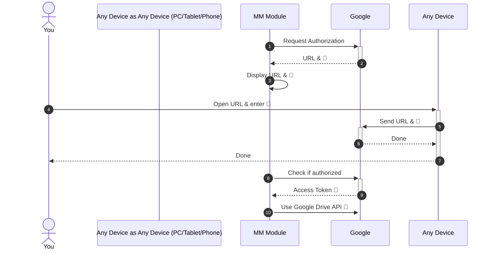

# MMM-GoogleDocs-Notes

This a module for <strong>MagicMirror</strong><br>
https://magicmirror.builders/<br>
https://github.com/MichMich/MagicMirror

This module displays a Google Doc as note from your Google account.


## Installation

1. Navigate to your MagicMirror `modules` directory and execute<br /> `git clone https://github.com/No3x/MMM-GoogleDocs-Notes.git`

2. Enter the new `MMM-GoogleDocs-Notes` directory and execute `npm install`.

3. Obtain token ([see Authentication & Authorization](#authentication--authorization))

4. Add the module to your config ([see Sample Configuration](#sample-config)).

## Google Keep
Unfortunately Google does not provide an API for Keep to query the content for a note from there. Therefore, we use a Google Doc that can be edited by multiple users.

## Changes

### 3.0.0
Before version 3 the module used the OAuth 2.0 out-of-band (OOB) authentication flow. It was basically the manual copy/paste option, as a legacy flow developed to support native clients which do not have a redirect URI to accept the credentials after a user approves an OAuth consent request. This authentication mechanism used before was deprecated by Google.

With version 3 the authentication changed to OAuth 2.0 for TV and Limited-Input Device Applications. The scope `https://www.googleapis.com/auth/drive.file` is used which means the module can access files created by the module only and has no access to the rest of your drive.


1. MM Module sends a request to Google's authorization server and asks for scope `drive.file`.
2. The Google server responds with several pieces of information used in subsequent steps, such as a device code and a user code.
3. The prompt will show you the information that you can enter on a separate device to authorize the module to access your Google Drive.
4. You switch to a device with richer input capabilities, launch a web browser, navigate to the URL displayed in step 3 and enter a code that is also displayed in step 3. You can then grant (or deny) access to your Google Drive.
5. Transfer
6. Done
7. Done
8. MM Module checks Google's authorization server to determine whether your have authorized the module.
9. If granted the next response contains the tokens the module needs to authorize requests on your behalf.
10. The token is used for Google Drive API access

This changes imply
1. Previously it was possible to scan your Google Docs by searching for the `notesPrefix`. Now it is possible to access files created by the module only. Therefore, the module will create a new Google Doc if not present (by using `notesPrefix`). This implies there is support for only one note at a time currently.

## Authentication & Authorization
It is very important that you follow these steps. Before this module will work, you need to grant authorization for this module to access your Google Drive account.

1. Go to https://console.developers.google.com/flows/enableapi?apiid=drive&pli=1 and create a new project. If you use an existing one, it might conflict with your existing project.
2. Once you've created your project, click *Continue*, then *Go to credentials*.
3. On the *Add credentials to your project* page, click the *Cancel* button.
4. At the top of the page, select the *OAuth consent screen* tab.
5. Enter the Product name e.g. `Magic Mirror Notes`.
6. Select your GMail address. This is just the account with which you are associating your developer account.
7. Click the *Save* button.
8. Select the *Credentials* tab, click the *Create credentials* button and select *OAuth client ID*.
9. Select the application type *TV and limited Input Devices*
10. Enter a name e.g. `Magic Mirror Notes`.
11. Click the *Create* button.
12. Click *OK* to dismiss the resulting dialog.
13. Click the file download icon button to the right of the client ID.
14. Rename this file `client_secret.json` and copy it to your MMM-GoogleDocs-Notes directory.
15. In the *MMM-GoogleDocs-Notes* directory execute
     1. `node authorize.js`
     2. or if you run MM on a raspberry pi `sudo -u pi -- node authorize.js` (Change `pi` to the user that runs the Magic Mirror application).
16. Follow the instructions to authorize the Google account for which you want to display notes on your mirror.
    1. You will see a URL and a code
    2. Open the URL on a PC, Tablet, Phone or any device and enter the code
    3. Login to you google account
    4. Grant access to your Google Drive

If everything went well, you should see `MMM-GoogleDocs-Notes is authorized` in your console.

Note: This application uses the following scopes:
```text
https://www.googleapis.com/auth/drive.file
```

## Configuration

<table>
  <thead>
    <tr>
      <th>Option</th>
      <th>Description</th>
    </tr>
  </thead>
  <tbody>
    <tr>
      <td><code>maxNotes</code></td>
      <td>The maximum number of your most recent documents to display<br><br><strong>Type</strong> <code>Number</code><br>Defaults to <code>2</code></td>
    </tr>
    <tr>
      <td><code>pollFrequency</code></td>
      <td>How frequently to poll Drive for documents.<br><br><strong>Type</strong> <code>Number</code><br>Defaults to <code>300000</code> (5 minutes)</td>
    </tr>
    <tr>
      <td><code>showDatePosted</code></td>
      <td>Whether to show the date when the note was created<br><br><strong>Type</strong> <code>Boolean</code><br>Defaults to <code>true</code> (5 minutes)</td>
    </tr>
    <tr>
      <td><code>dateFormatExact</code></td>
      <td>the date format to use for the exact posted date (not today and not yesterday).  Uses Moment.js supported date formats (https://momentjs.com/docs/#/displaying/)<br><br><strong>Type</strong> <code>String</code><br>Defaults to <code>YYYY-MM-DD HH:mm</code></td>
    </tr>
    <tr>
      <td><code>dateFormatShort</code></td>
      <td>the short date format to use for the posted date (today and yesterday). Uses Moment.js supported date formats (https://momentjs.com/docs/#/displaying/)<br><br><strong>Type</strong> <code>String</code><br>Defaults to <code>HH:mm</code></td>
    </tr>
    <tr>
      <td><code>notesPrefix</code></td>
      <td>the prefix of your documents titles you store your note in.<br><br><strong>Type</strong> <code>String</code><br>Defaults to <code>MMM</code></td>
    </tr>
  </tbody>
</table>

## Sample Config

The current procedure: it queries for all documents, filters by titles that start with `notesPrefix`, orders by the last edited document and displays at most `maxNotes` number of noes.
```
{
  module: 'MMM-GoogleDocs-Notes',
  header: "Notes",
  position: 'top_right',
  classes: 'default everyone',
  config: {
    maxNotes: 2,
    pollFrequency: 5 * 60 * 1000, //5 minutes;
    showDatePosted: true,
    dateFormatExact: 'YYYY-MM-DD HH:mm',
    dateFormatShort: 'HH:mm',
    notesPrefix: 'MMM'
  }
},
```

## Troubleshooting
### OAuth
Since the OAuth-Authorization-Token is stored in the users home directory make sure to execute `node authorize.js` as the same user that runs the MagicMirror instance (user `pi` in my case).
To ensure it execute the command explicitly as user `pi`: `sudo -u pi -- node authorize.js`
### Outputs
While setup watch the logs: `tail -f /home/pi/.pm2/logs/mm-out.log`. Log messages are prefixed with `[MMM-GoogleDocs-Notes]`. Watch out for scope errors and urls to open your browser in case the scope is not sufficient (like `The drive API returned an error: Error: Insufficient Permission: Request had insufficient authentication scopes.`).

## Tips


1. Change the background color of your Google Doc to match your MagicMirror background. This way you can design your contents to look good on the mirror. `File > Page setup > Page color`
2. Widths and heights of elements are removed for all elements to support responsive images (e.g. see the table column widths)
3. Use all Google Docs features like embedding charts from a Google Sheet. The embedded chart has a recolor image effect `Negative` that is unfortunately not properly exported. But you can change the colors of the diagram in the source document - with this the export works fine.

## Credits
This module uses the scaffolding of https://github.com/jclarke0000/MMM-MyNotes.git which served as starting point. Most functionality was taken from it but the interaction with the Drive API was added and some modifications were made.
